<h1 align="center">Vacation Calculator</h1>

[View the live project here.](https://vacation-calculator-0f929794e117.herokuapp.com/)

The Vacation Calculator is a helpful tool designed to assist users in calculating their entitlement to paid vacation days in compliance with the Swedish Vacation Act. By inputting specific parameters, users can determine the number of paid vacation days they will receive during a given vacation year.

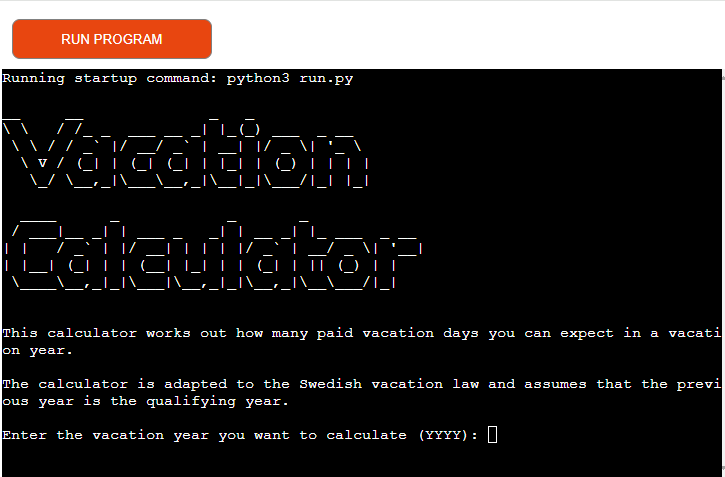

## User Experience (UX)

### Project Goal

My goal with this application is to provide a user-friendly Vacation Calculator that ensures accurate and reliable calculations based on user input. 

### Target Audience

The target audience consists of employees working for employers covered by the Swedish Vacation Act. 

### User Stories

#### First Visitor Goals

1. As a First Time Visitor, I want to easily understand the main purpose of the application.

2. As a First Time Visitor, I want to know right away how to start and a clear and concise step-by-step guidance in how to use the application.

3. As a First Time Visitor, I want feedback if my input is not correct in some way.

4. As a First Time Visitor, I want to be able to get more detailed information about rules in the Swedish Vacation Act.

5. As a First Time Visistor, I want the result, the number of paid vacation days presented to me.

#### Returning Visitor Goals

1. As a Returning Visitor, I want to be able to start the calculations right away and follow a clear and concise step-by-step guidance in how to use the application.

2. As a Returning Visitor, I want feedback if my input is not correct in some way.

3. As a Returning Visitor, I want to be able to choose if I want more detailed information about the rules in the Swedish Vacation Act or not. 

4. As a Returning Visitor, I want the result, the number of paid vacation days presented to me.

## Flow Chart

I used Canva to produce my flow chart. 

https://www.canva.com/

The flow chart largely corresponds to the final product except for the "Explain absence data" feature that I added during development. 

[View the Flow Chart of the project here.](https://www.canva.com/design/DAF-QQF54tg/LDPiva1vMDlR_EAO3aPBlw/view?utm_content=DAF-QQF54tg&utm_campaign=designshare&utm_medium=link&utm_source=editor)

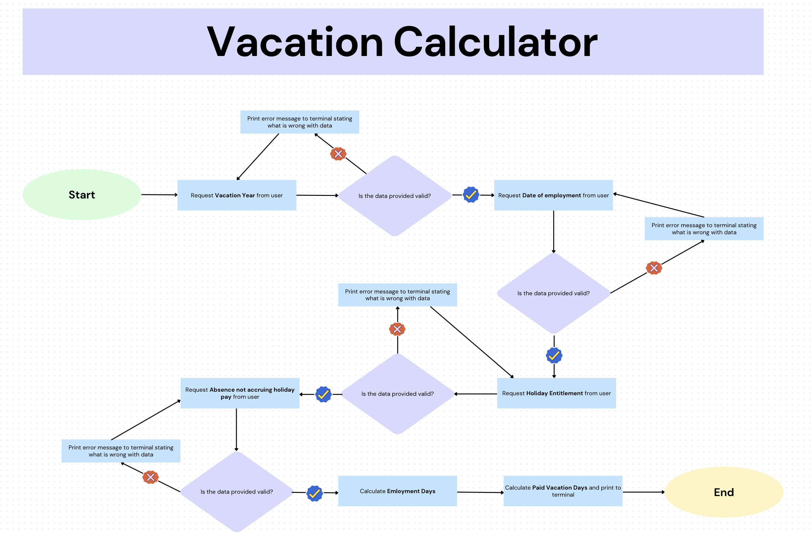

## Features

### Existing features

#### Start the calculator

- Welcomes the user
- Explains the conditions
- Let the user enter the vacation year

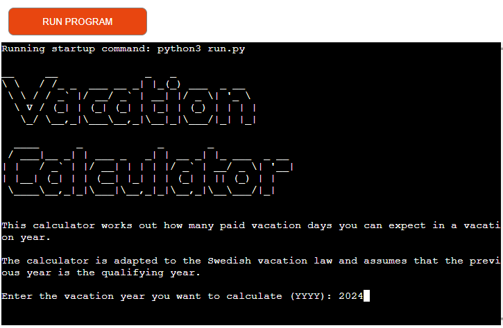

#### Select and validate vacation year

- When the user enters the vacation year, the input is validated to ensure that it is in the correct date format.

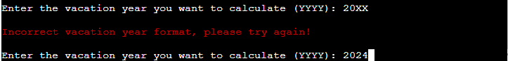

#### Enter and validate employment date

- When the user enters the employment date, the input is validated to ensure that it is in the correct date format.

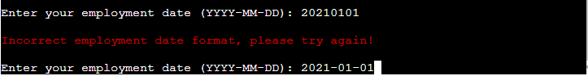

#### Enter and validate holiday entitlement

- When the user enters their holiday entitlement the input is converted to an integer, the validate function controls that it is at least 25 days (which is the minimum by law) and that the format is correct.

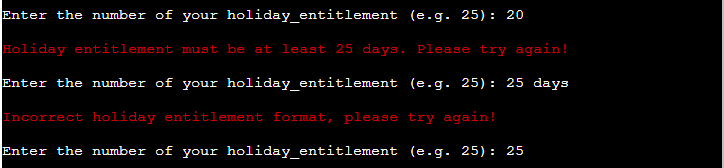

#### Explain absence data

- Before the user can enter their absence data, they get a choice and a recommendation to read more about absence data. The user is responsible for entering correct absence data and should be aware of the rules that apply.

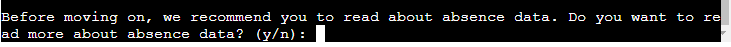

- If the user choose to read more about absence data the following text is presented:

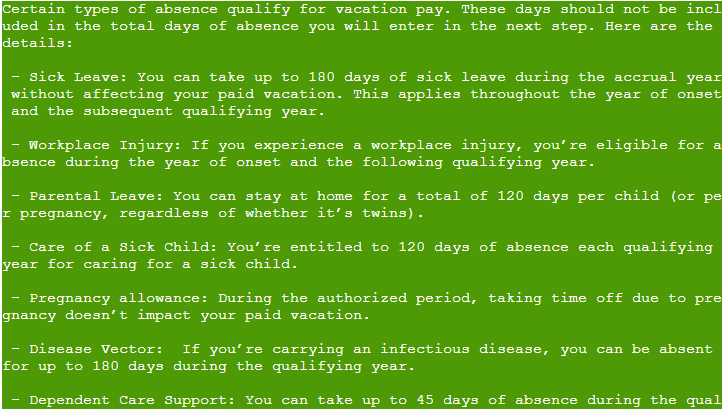
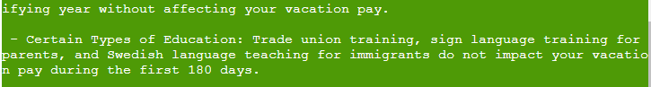

#### Enter and validate absence data

- When the user enters their absence data the input is converted to an integer. The validate function controls the format of the input and print out if it's not valid.

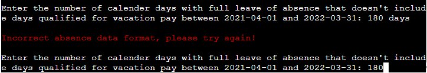

#### Calculate employment days

- The function calculates how many employment days the user got during the vacation year by comparing the employment date with the last day of the vacation year.

#### Calculate and display paid vacation days

- The function calculates how many paid vacation days the user will get. It reduces leave of absence from total employment days. In the next step, the remaining days are related to the days in the current vacation year and are multiplied by the vacation entitlement. At last the result is being rounded up just as it should be according to the law. If there are unpaid vacation days they also will be displayed.

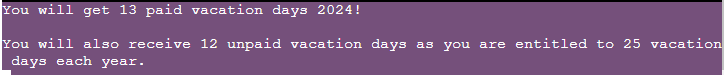

### Future Features

- Improved error handling for invalid number of days. Specifically, I want to address scenarios where the total number of days exceeds the total days in a year. For example, if a user starts their employment at the end of the year and has been absent for 300 days, the system will recognize that the total exceeds the available days in the year.

- One possible future feature could be that allow the user to input the number of absence days they've taken for each absence category (such as sick leave, parental leave, etc.). The system will then determine whether these absences are eligible for calculating vacation pay. To achieve this, the system will have functions that calculate which days should be included or excluded from the vacation calculation.

## Technologies Used

### Languages Used

- [Python](https://en.wikipedia.org/wiki/Python_(programming_language))

### Libraries Used

#### Python Standard Libraries

##### Datetime Module
- I used the Datetime Module to parse vacation year and employment date into datetime objects and to be able to validate the input format.

https://stackoverflow.com/questions/74091035/how-do-i-validate-a-date-format-with-python

##### Math Module
- I used the Math Module to be able to round up the result of the paid vacation days.

https://www.w3schools.com/python/ref_math_ceil.asp

#### Other Libraries

##### Pyfiglet Module
- I used the Pyfiglet Module to style the program’s header and enhance the visual presentation of the application.

https://www.geeksforgeeks.org/python-ascii-art-using-pyfiglet-module/

##### Colorama Module
- I used the Colorama Module to be able to use different colours to the text.

https://stackoverflow.com/questions/46349444/how-to-add-color-to-text-in-python

### Other Technologies Used

- [Git](https://git-scm.com/) was used for version control by utilizing the Gitpod terminal to commit to Git and Push to GitHub.

- [GitHub](https://github.com/) is used to store the projects code after being pushed from Git.

- [Heroku](https://heroku.com/) was used for deployment of the application.

- [CI Python Linter](https://pep8ci.herokuapp.com/) was used for checking PEP8 errors.

## Testing

### Validator Testing

[The CI Python Linter](https://pep8ci.herokuapp.com/) displays "All clear, no errors found".

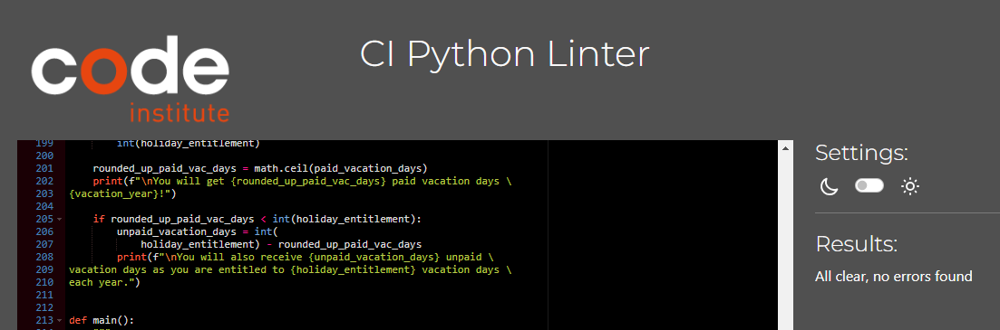

### User Stories Testing

#### First Visitor Goals

1. As a First Time Visitor, I want to easily understand the main purpose of the application.

When users launch the application, they are greeted with a brief and clear information message. The text explains that the app functions as a vacation days calculator, specifically tailored to Swedish vacation law. It assumes that the preceding year serves as the qualifying year for calculating paid vacation days.

2. As a First Time Visitor, I want to know right away how to start and a clear and concise step-by-step guidance in how to use the application.

The user is asked to enter the vacation year they want to calculate in the first step right after the information text. In the following steps the user is asked to enter employment date, holiday entitlement etc.

3. As a First Time Visitor, I want feedback if my input is not correct in some way.

If the user enters a vacation year, an employment date or a holiday entitlement in the wrong format an error messege appears that encourage the user to try again.

4. As a First Time Visitor, I want to be able to get more detailed information about rules in the Swedish Vacation Act.

The user get's a choice and a recommendation to read more about absence data. If the user enters y (yes) a detailed description of certain types of absence that qualifies for vacation pay appears.

5. As a First Time Visistor, I want the result, the number of paid vacation days presented to me.

Once the user has provided all the requested input, the number of paid and unpaid vacation days is presented to the user.

#### Returning Visitor Goals

1. As a Returning Visitor, I want to be able to start the calculations right away and follow a clear and concise step-by-step guidance in how to use the application.

The user is asked to enter the vacation year they want to calculate in the first step right after the information text. In the following steps the user is asked to enter employment date, holiday entitlement etc.

2. As a Returning Visitor, I want feedback if my input is not correct in some way.

If the user enters a vacation year, an employment date or a holiday entitlement in the wrong format an error messege appears that encourage the user to try again.

3. As a Returning Visitor, I want to be able to choose if I want more detailed information about the rules in the Swedish Vacation Act or not. 

The user get's a choice and a recommendation to read more about absence data. If the user already knows about the absence data rules they can enter n (no) and proceed and enter their absence data.

4. As a Returning Visitor, I want the result, the number of paid vacation days presented to me.

Once the user has provided all the requested input, the number of paid and unpaid vacation days is presented to the user.

### Further Testing

- A large amount of testing was done to ensure that the application functions work as intended.

## Deployment

The app was deployed through Heroku. The steps are as following:

1. Add a new line character at the end of the text inside the input method. Without this extra line, the text for the input request will not show up in the terminal.

2. Update the requirements.txt file with colorama and pyfiglet so that Heroku can install these dependencies.

3. Create a Heroku account.

4. Create a new app from Heroku dashboard.

5. Go to Settings and add Config Vars and Buildpacks. Below Config Vars add PORT to KEY and 8000 to VALUE. Below Buildpacks add Python and NodeJS (in that order).

6. Go to Deploy section. Choose GitHub as deployment method. Search for the repository name and click "Connect" to link the Heroku app to the GitHub repository code. 

7. Scroll down to the deploy options. Click "Enable Automatic Deploys". This option will update the Heroku app with every "git push" which was chosen for this project. 

## Credits

- I was inspired by my classmate Raneem Yad to use the pyfiglet module. She also shared where I could find instructions on how to install and use pyfiglet.

- My Mentor, Spencer Barriball, for continuous helpful feedback.

